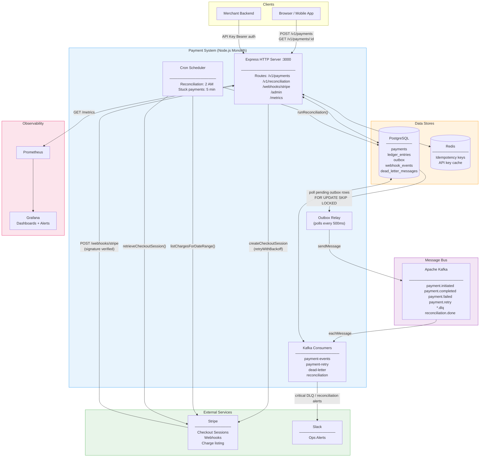

# System Architecture

High-level view of all components, external services, and how data flows between them.

## Key Design Decisions

- **Monolith with clear domain boundaries** — single deployable unit, but strict layering enforced by code convention (no cross-domain imports except via injected interfaces).
- **Stripe as hosted PSP** — the payment UI lives on Stripe's servers. The system never handles raw card numbers (PCI scope reduction).
- **Kafka for internal events** — all post-payment processing (analytics, ledger, notifications) is decoupled from the payment creation path via the Outbox Pattern.
- **Dual data stores** — PostgreSQL for durable transactional state, Redis for low-latency idempotency checks and API key caching.
- **Observability first** — every HTTP request, Kafka message, Stripe call, and background job emits Prometheus metrics with labels; Grafana alerts on DLQ depth, reconciliation mismatches, and p99 latency.
