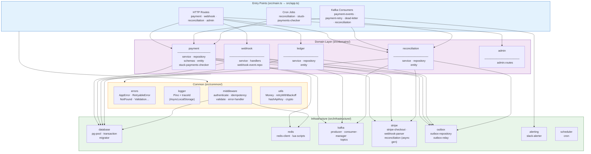

# Code Architecture — Layer Diagram

Strict dependency direction: **Entry Points → Domain → Common ← Infrastructure**.
Domain code never imports from Infrastructure directly — all I/O adapters are injected via constructors.



## Directory Structure

```
src/
├── main.ts                      # Bootstrap: connects all deps in startup order
├── app.ts                       # Express factory — middleware stack, route mounting
├── config/                      # Env var validation (zod) — crashes on missing vars
├── common/
│   ├── errors/                  # AppError hierarchy + RetryableError marker
│   ├── logger/                  # Pino with AsyncLocalStorage traceId mixin
│   ├── middleware/              # authenticate, idempotency, validate, error-handler
│   ├── tracing/                 # AsyncLocalStorage store for traceId/correlationId
│   └── utils/                  # Money (bigint), retryWithBackoff, crypto
├── domains/
│   ├── payment/                 # Core payment lifecycle
│   ├── webhook/                 # Stripe webhook event processing
│   ├── ledger/                  # Double-entry bookkeeping
│   ├── reconciliation/          # DB vs Stripe nightly comparison
│   └── admin/                   # Ops endpoints (DLQ replay, state dump)
├── kafka/
│   └── consumers/               # Consumer registrations (thin wrappers)
├── infrastructure/
│   ├── database/                # pg-pool, transaction helper, migrator
│   ├── redis/                   # ioredis singleton + Lua atomic scripts
│   ├── kafka/                   # KafkaJS producer, consumer-manager, topics
│   ├── stripe/                  # Stripe SDK wrappers with retry logic
│   ├── outbox/                  # Outbox repository + relay polling loop
│   ├── scheduler/               # node-cron job setup
│   └── alerting/                # Slack webhook sender
└── metrics/                     # Prometheus metric definitions + /metrics endpoint
```

## Dependency Rules

| Layer | Can import from | Cannot import from |
|---|---|---|
| Entry Points | Domain, Common, Infrastructure | — |
| Domain | Common, Infrastructure (injected) | Other Domains directly |
| Common | — | Domain, Infrastructure |
| Infrastructure | Common | Domain |
