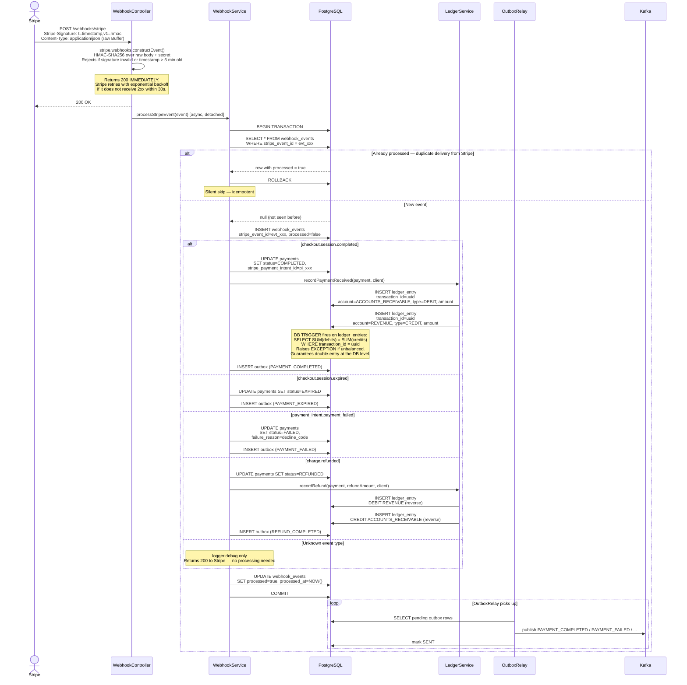

# Webhook Payment Completion Flow

How Stripe webhook events are received, verified, deduplicated, and processed — all within a single atomic database transaction.



## Critical Properties

### Why Return 200 Immediately?
Stripe will retry a webhook if it doesn't receive a `2xx` within **30 seconds**. The actual processing (DB writes, ledger entries) can take longer, and failures should not cause Stripe to retry — because each retry would be a new duplicate delivery, handled by the deduplication layer.

### Idempotency by `stripe_event_id`
Stripe can deliver the same event multiple times (at-least-once guarantee). The `webhook_events` table stores every `stripe_event_id` seen. On duplicate delivery:
- If `processed = true` → silently skip (the first delivery already completed successfully).
- If `processed = false` → first delivery is still in-flight or failed mid-transaction; the new delivery can proceed.

### Everything in One Transaction
All five writes happen atomically:
1. `webhook_events` dedup record
2. `payments` status update
3. `ledger_entries` rows (×2 for double-entry)
4. `outbox` row for downstream Kafka event
5. `webhook_events.processed = true`

A crash at any point rolls back all writes. The next retry starts clean.

### Double-Entry Ledger Enforcement
The DB trigger on `ledger_entries` runs `AFTER INSERT` and checks:
```sql
SELECT SUM(amount) FILTER (WHERE entry_type = 'DEBIT')
     = SUM(amount) FILTER (WHERE entry_type = 'CREDIT')
WHERE transaction_id = NEW.transaction_id
```
An imbalance raises a Postgres exception, rolling back the entire transaction. The ledger **cannot** become inconsistent — not even through a code bug.
