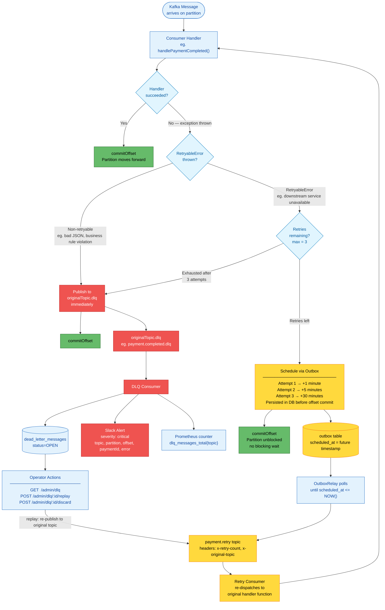

# Kafka Retry & Dead-Letter Queue Architecture

Three-path routing for every Kafka message failure. Implements Figure 12 from the Pragmatic Engineer payment systems article.



## Three Routing Paths

### Path 1 — Success
Handler completes without throwing. Offset is committed. Partition advances normally.

### Path 2 — Retryable Failure (`RetryableError`)
Thrown by handler code for **transient** failures (downstream service temporarily down, network timeout, rate limit). The message is **not** retried inline — that would block the partition for up to 30 minutes.

Instead, the retry is **durable**:
1. Write retry payload + `scheduled_at` to the `outbox` table (inside a DB write, before committing the Kafka offset).
2. Commit the Kafka offset — the partition is immediately free for the next message.
3. The `OutboxRelay` polls `outbox` until `scheduled_at <= NOW()`, then publishes to `payment.retry`.
4. The retry consumer reads from `payment.retry` and calls the same handler function.
5. If that attempt also throws `RetryableError`, the retry count increments and it loops back (up to `maxRetries`).
6. Once `maxRetries` is exhausted, the message is routed to the DLQ.

**Retry delay schedule** (exponential, durable):

| Attempt | Delay |
|---------|-------|
| 1st retry | +1 minute |
| 2nd retry | +5 minutes |
| 3rd retry | +30 minutes |
| Exhausted | → DLQ |

### Path 3 — Non-Retryable Failure
Any exception that is **not** a `RetryableError` (e.g. `JSON.parse` fails, a business rule is violated). No retry is attempted — retrying would just fail again. The message goes directly to the DLQ.

## Why Durable Retries via Outbox?

The naive approach — retrying inline with `await sleep(delay)` — has two problems:
1. **Blocked partition**: the consumer holds the partition for the entire delay window (up to 30 min), preventing other messages from being processed.
2. **Lost on crash**: if the process restarts during the delay, the retry is silently dropped.

The outbox-based approach solves both: the partition is freed immediately, and the retry survives any process crash because it is persisted in PostgreSQL before the offset is committed.

## Kafka Topics

```
payment.initiated          ← payment created, checkout session opened
payment.completed          ← payment confirmed via Stripe webhook
payment.failed             ← payment failed or expired
payment.expired            ← checkout session expired
payment.retry              ← durable retry queue (all topics share one retry queue)
payment.initiated.dlq      ← dead letters from payment.initiated processing
payment.completed.dlq      ← dead letters from payment.completed processing
payment.failed.dlq         ← dead letters from payment.failed processing
payment.retry.dlq          ← dead letters after all retry attempts exhausted
reconciliation.done        ← nightly reconciliation result
```

## Error Classification Guide

| Throw | When |
|-------|------|
| `RetryableError` | Downstream HTTP 503/429, network timeout, temporary DB unavailability |
| Any other `Error` | Invalid message payload, business rule violation, permanent data issue |
