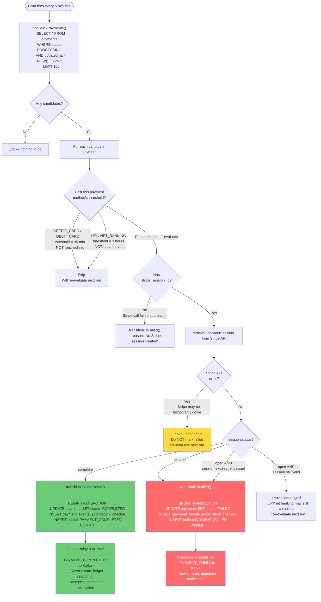

# Stuck Payments Recovery (Payment Delay Handling)

Handles the case where a Stripe webhook is missed or delayed — common with async payment methods like UPI and net banking.

## Why This Is Needed

Stripe sends webhooks for payment completion/failure, but they can be:
- **Missed**: network issues between Stripe and the application.
- **Delayed**: Stripe queues webhooks and retries with exponential backoff — delays of minutes or hours are possible.
- **Lost on restart**: if the application was down when Stripe attempted delivery.

For **UPI and net banking**, the payment itself is asynchronous — the customer may not complete the bank redirect immediately, and bank processing can legitimately take 1–3 hours. Webhooks for these methods arrive later than card payments.

The `StuckPaymentsChecker` acts as a **safety net**: it periodically polls Stripe directly for any payment that has been in `PROCESSING` too long, recovering missed webhook events.

## Per-Method Thresholds

| Payment Method | Threshold | Rationale |
|---|---|---|
| CREDIT_CARD | 35 min | Stripe checkout session expires after 30 min; +5 min buffer for webhook arrival |
| DEBIT_CARD | 35 min | Same as credit card |
| UPI | 3 hours | Bank processing is genuinely async; false positive risk high if threshold is low |
| NET_BANKING | 3 hours | Same as UPI |

## Event Source in Audit Trail

When the checker recovers a payment, the event is recorded with `actor = "stuck_payments_checker"` in `payment_events`, so operators can distinguish:
- `actor = "stripe_webhook"` — normal completion via webhook
- `actor = "stuck_payments_checker"` — recovered by polling Stripe

The outbox payload also carries `recoveredByChecker: true` for downstream consumers to handle appropriately (e.g. skip duplicate analytics recording).

## Prometheus Metrics

| Metric | Labels | Meaning |
|---|---|---|
| `stuck_payments_detected_total` | `method` | How often payments are found stuck |
| `stuck_payments_recovered_total` | `method, outcome` | How often they are successfully recovered; `outcome` = `completed` or `failed` |
