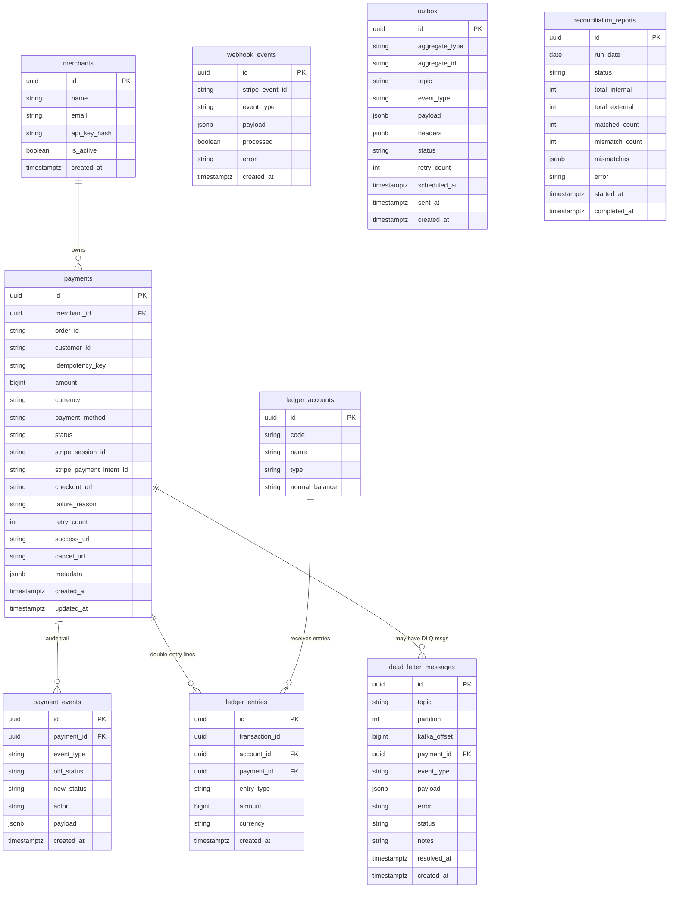

# Database Schema

All nine tables, their columns, and relationships. All monetary amounts are stored as `BIGINT` minor units (cents, paise) — never floats.



## Table Reference

### `merchants`
One row per merchant. API keys are stored as HMAC-SHA256 hashes — the plaintext is never persisted after generation.

### `payments`
Central table. Lifecycle: `PENDING → PROCESSING → COMPLETED | FAILED | EXPIRED | REFUNDED`.

| Column | Notes |
|---|---|
| `amount` | BIGINT minor units (e.g. 1000 = $10.00 USD / ₹10.00 INR) |
| `payment_method` | `CREDIT_CARD`, `DEBIT_CARD`, `UPI`, `NET_BANKING` |
| `status` | `PENDING`, `PROCESSING`, `COMPLETED`, `FAILED`, `EXPIRED`, `REFUNDED`, `CANCELLED` |
| `idempotency_key` | UNIQUE per `(merchant_id, idempotency_key)` — DB-level duplicate prevention |
| `stripe_session_id` | Stripe Checkout Session ID (`cs_xxx`) |
| `stripe_payment_intent_id` | Set when payment completes (`pi_xxx`) — used for reconciliation |

### `payment_events`
Immutable append-only audit log. Every status transition writes a row with the `actor` field (e.g. `stripe_webhook`, `stuck_payments_checker`, `reconciliation`). Never updated or deleted.

### `ledger_accounts` (seeded)
| Code | Type | Normal Balance |
|---|---|---|
| `ACCOUNTS_RECEIVABLE` | ASSET | DEBIT |
| `REVENUE` | REVENUE | CREDIT |
| `REFUNDS_PAYABLE` | LIABILITY | CREDIT |
| `STRIPE_FEES` | EXPENSE | DEBIT |

### `ledger_entries`
Double-entry bookkeeping. Every payment completion creates two rows sharing the same `transaction_id`:
- DEBIT `ACCOUNTS_RECEIVABLE` +amount
- CREDIT `REVENUE` +amount

A **PostgreSQL trigger** (`AFTER INSERT`) validates that `SUM(debits) = SUM(credits)` for each `transaction_id`. An imbalanced insert raises an exception and rolls back the transaction — the ledger cannot become inconsistent.

### `webhook_events`
Deduplication table for Stripe webhook events. Indexed on `stripe_event_id` (UNIQUE). `processed = false` means the event was received but processing failed mid-transaction — next delivery can retry. `processed = true` means the event was fully handled.

### `outbox`
Implements the Transactional Outbox Pattern. Written in the same DB transaction as the business data. The `OutboxRelay` polls `WHERE status = 'PENDING' AND scheduled_at <= NOW()` using `FOR UPDATE SKIP LOCKED`.

| `status` | Meaning |
|---|---|
| `PENDING` | Waiting to be published |
| `SENT` | Successfully published to Kafka |
| `FAILED` | Exhausted max retries; requires investigation |

`scheduled_at` is used for durable Kafka consumer retries — set to a future timestamp when a consumer handler fails with `RetryableError`.

### `dead_letter_messages`
Messages that could not be processed after all retry attempts. Operators manage these via `/admin/dlq`.

| `status` | Meaning |
|---|---|
| `OPEN` | Requires operator action |
| `RESOLVED` | Replayed successfully |
| `IGNORED` | Discarded by operator (with required note) |

### `reconciliation_reports`
One row per reconciliation run. `mismatches` is a `JSONB` array of mismatch objects with `type`, `paymentId`, `stripeChargeId`, `description`. `run_date` has a UNIQUE constraint — one report per day.

## Key Indexes

```sql
-- Idempotency enforcement (business rule + performance)
UNIQUE INDEX ON payments(merchant_id, idempotency_key)

-- Fast webhook deduplication
UNIQUE INDEX ON webhook_events(stripe_event_id)

-- OutboxRelay polling (partial index — only PENDING rows)
INDEX ON outbox(scheduled_at, created_at) WHERE status = 'PENDING'

-- Payment list queries (keyset pagination)
INDEX ON payments(merchant_id, created_at DESC, id DESC)

-- Stuck payments detection
INDEX ON payments(status, updated_at) WHERE status = 'PROCESSING'

-- DLQ management
INDEX ON dead_letter_messages(status)
INDEX ON dead_letter_messages(payment_id)
```
