# Two-Layer Idempotency

Prevents duplicate payments even under concurrent requests, retries, and infrastructure failures (Redis restart, process crash).

```mermaid
flowchart LR
    REQ(["POST /v1/payments
    Authorization: Bearer key
    Idempotency-Key: abc-123
    Body: { amount: 5000, ... }"]) --> L1_CHECK

    subgraph L1["Layer 1 — Redis  (Fast Path, ~1ms)"]
        L1_CHECK["Lua script:
        SET idempotency:merchant:abc-123
            response_json
            NX EX 86400
        (atomic — no TOCTOU race)"]
        L1_HIT{Key exists?}
        L1_CHECK --> L1_HIT
    end

    L1_HIT -->|"HIT
    Key was already set"| CACHED["Return cached
    HTTP status + response body
    No DB touch, no Stripe call"]

    L1_HIT -->|"MISS
    First time seeing this key"| AUTH["Authenticate merchant
    (Redis cache → DB fallback)"]

    AUTH --> SVC["PaymentService.createPayment()
    BEGIN TRANSACTION
    INSERT payments (amount, currency, ...)
    stripe.checkout.sessions.create()
    UPDATE payments (stripe_session_id)
    INSERT outbox
    COMMIT"]

    SVC --> L2

    subgraph L2["Layer 2 — PostgreSQL  (Durable Fallback)"]
        L2_CHECK["UNIQUE INDEX ON
        payments(merchant_id, idempotency_key)
        ─────────────────────────────────────
        DB rejects a duplicate INSERT
        with a unique constraint violation
        even if Redis was wiped mid-request"]
    end

    L2 -->|"INSERT succeeds
    New payment"| RESP_OK["201 Created
    { paymentId, checkoutUrl }
    Cache response in Redis"]

    L2 -->|"INSERT fails
    Duplicate key violation"| RESP_DUP["409 Conflict
    or return existing payment
    (merchant retries are safe)"]

    RESP_OK --> L1_STORE["SET cached response
    in Redis for 24h"]

    style L1 fill:#e3f2fd,stroke:#1565C0
    style L2 fill:#fff3e0,stroke:#E65100
    style CACHED fill:#6bcb77
    style RESP_OK fill:#6bcb77
    style RESP_DUP fill:#ffd93d
    style L1_STORE fill:#6bcb77
```



## Why Two Layers?

Each layer protects against a different failure scenario:

| Scenario | Redis alone | PostgreSQL alone | Both layers |
|---|---|---|---|
| Normal duplicate request | ✅ Caught in Redis | ✅ Caught in DB | ✅ |
| Concurrent duplicate requests (race) | ✅ Lua NX is atomic | ✅ DB unique constraint is atomic | ✅ |
| Redis was down or restarted | ❌ Missed | ✅ Caught in DB | ✅ |
| Process crashed after DB write, before Redis write | ❌ Redis has no entry — next request goes through | ✅ DB rejects duplicate | ✅ |
| Redis evicted the key (memory pressure) | ❌ Missed | ✅ Caught in DB | ✅ |

## Redis Lua Script

The idempotency check uses a single **Lua script** executed atomically by Redis:

```lua
-- Check + set in one atomic operation (no TOCTOU window)
local existing = redis.call('GET', KEYS[1])
if existing then
  return existing   -- return cached response
end
redis.call('SET', KEYS[1], ARGV[1], 'NX', 'EX', ARGV[2])
return nil          -- nil = first time, proceed with processing
```

Why Lua instead of `GET` + `SET`? Between a `GET` (returns null) and a `SET`, another request could win the race and also see null — resulting in two payments being created. The Lua script is guaranteed to execute as a single indivisible operation by Redis.

## Request Hashing

The idempotency middleware also hashes the **request body** and stores it alongside the cached response. If the same `Idempotency-Key` is reused with a **different body** (different amount, different currency), the middleware returns a `422 Unprocessable Entity` — the key is locked to the original request parameters.

## Key Format and TTL

```
Redis key:  idempotency:{merchantId}:{idempotencyKey}
TTL:        86400 seconds (24 hours)
```

The 24-hour TTL means merchants must use a fresh key for new payment attempts after 24 hours. Within 24 hours, retrying with the same key is safe — it will return the original response.

## PostgreSQL Unique Index

```sql
-- From migration 002_create_payments.sql
CREATE UNIQUE INDEX ON payments(merchant_id, idempotency_key);
```

This index is scoped per `merchant_id` so that two different merchants can use the same key value without conflict. It is a **durable** constraint — it survives Redis restarts, deployments, and process crashes.
